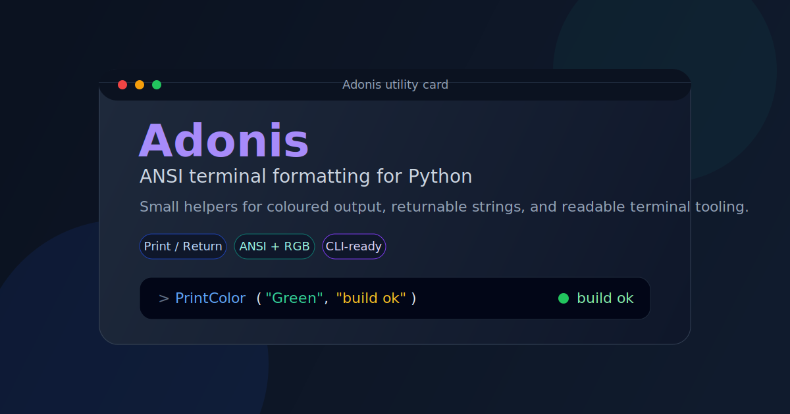

# Adonis

## Summary
`Adonis` is a small Python library for working with ANSI terminal colours. I built it as a lightweight utility so I could print or return coloured strings without rewriting escape sequences by hand, while keeping the API small enough to be easy to drop into scripts and terminal tools.



## What This Project Demonstrates
- Python utility-library design around a small focused API
- separating print-based helpers from return-based helpers
- storing ANSI escape sequences in reusable palettes
- generating RGB rainbow output with a sine-wave function
- handling small formatting variants such as bold, underline, and backgrounds
- building tests around the current behavior of an existing codebase

## Current Features
- print coloured text directly with `PrintColour(...)`
- return coloured text with `ReturnColour(...)`
- expose American-spelling aliases such as `PrintColor(...)` and `ReturnColor(...)` at the package root and in the print/return modules
- support standard ANSI colours including black, red, green, yellow, blue, purple, cyan, and white
- support an `Empty` mode that returns or prints plain text
- support a `Rainbow` mode for per-character RGB colouring
- support bold, underline, background, high-intensity, and bold high-intensity variants
- support direct RGB colour formatting through `PrintRGBColour(...)` and `ReturnRGBColour(...)`
- include convenience helpers such as `PrintError(...)`, `PrintInfo(...)`, `PrintWarning(...)`, `ReturnError(...)`, `ReturnInfo(...)`, and `ReturnWarning(...)`
- include basic table-style formatting helpers with `PrintTable(...)` and `ReturnTable(...)`
- expose the main print and return helpers through the package `__init__.py`

## Behavior Notes (Current)
- **Two API styles:** `PrintColour.py` writes directly to stdout, while `ReturnColour.py` returns ANSI-formatted strings for reuse elsewhere.
- **Shared helpers:** `utils.py` holds the shared helper functions, including colour validation, ANSI conversion helpers, and rainbow generation.
- **Colour normalization:** most colour-based functions normalize the first letter, so `"red"` and `"Red"` both resolve to `Red`.
- **Rainbow mode:** rainbow output is generated per character using `_rainbow(...)` in `utils.py`.
- **American spelling support:** `PrintColor(...)` and `ReturnColor(...)` are available from `Adonis`, `Adonis.PrintColour`, and `Adonis.ReturnColour`. Utility aliases such as `convert_color(...)` and `_checkColorInList(...)` exist in `Adonis.utils`.
- **Import surface:** `import Adonis` works, the package root exposes the main print and return helpers, and lower-level helpers remain available through `Adonis.utils`.
- **Output control:** the print-based helpers now support an `end=` argument so they can be composed without always forcing a newline.
- **Table helpers:** `PrintTable(...)` pads keys for aligned output and accepts a `spacing` override, while `ReturnTable(...)` returns a newline-separated coloured key/value string.

## Installation

If you want to try the library inside a virtual environment, you can install it directly from GitHub with `pip`.

### macOS / Linux

Create and activate a virtual environment:

```bash
python3 -m venv .venv
source .venv/bin/activate
```

Install the project from the repository:

```bash
python3 -m pip install git+https://github.com/jonathon-chew/Adonis.git
```

### Windows PowerShell

Create and activate a virtual environment:

```powershell
py -m venv .venv
.venv\Scripts\Activate.ps1
```

Install the project from the repository:

```powershell
py -m pip install git+https://github.com/jonathon-chew/Adonis.git
```

### Windows Command Prompt

Create and activate a virtual environment:

```bat
py -m venv .venv
.venv\Scripts\activate.bat
```

Install the project from the repository:

```bat
py -m pip install git+https://github.com/jonathon-chew/Adonis.git
```

After that, you can import `Adonis` from your script or Python session inside the active environment.

## Usage

The recommended import style is from the package root for the main helpers, and from `Adonis.utils` for the lower-level utility functions:

```python
from Adonis import PrintInfo, PrintColor, ReturnColour, ReturnColor
from Adonis.utils import convert_color
```

If you prefer, you can also import the package itself and call through the module namespace:

```python
import Adonis

Adonis.PrintInfo("ready")
message = Adonis.ReturnColor("Blue", "status: running")
print(message)
```

You can also import from the individual modules:

```python
from Adonis.PrintColour import PrintInfo, PrintColor
from Adonis.ReturnColour import ReturnColour, ReturnColor
```

## Examples

### Return A Formatted String

```python
from Adonis.ReturnColour import ReturnColour, ReturnBold

status = ReturnColour("Blue", "status: running")
headline = ReturnBold("Yellow", "Important")

print(status)
print(headline)
```

### Print Directly To The Terminal

```python
from Adonis.PrintColour import PrintInfo, PrintWarning, PrintRGBColour

PrintInfo("Everything is healthy")
PrintWarning("Disk usage is climbing")
PrintRGBColour(255, 120, 0, "Custom RGB message")
```

### Use The Package-Root American Aliases

```python
from Adonis import PrintColor, ReturnColor

PrintColor("Blue", "status")
message = ReturnColor("Green", "ready")
print(message)
```

### Use The Module-Level American Aliases

```python
from Adonis.PrintColour import PrintColor
from Adonis.ReturnColour import ReturnColor

PrintColor("Cyan", "module alias")
print(ReturnColor("Yellow", "module alias"))
```

### Build A Simple Table String

```python
from Adonis.ReturnColour import ReturnTable

summary = {
    "project": "Adonis",
    "language": "Python",
}

print(ReturnTable(summary))
```

Example output:

```python
project: Adonis 
language: Python
```

## Why This Is Different

Many terminal-colour helpers are either extremely minimal or wrapped into much larger CLI frameworks. I kept this project intentionally small and direct:
- one module for printing and one for returning strings
- explicit helper functions instead of a larger abstraction layer
- support for both standard ANSI styles and direct RGB output
- a compact codebase that is easy to read through in one sitting

That makes it useful as a practical helper for scripts, quick CLIs, and terminal-based tooling without pulling in a larger dependency surface.

## Testing

This project uses Python's built-in `unittest` module. The tests currently cover:
- coloured string output for the return-based API
- stdout behavior for the print-based API
- package-root American-spelling aliases for the main public helpers
- module-level American-spelling aliases for the print and return modules
- utility-level American-spelling aliases created by the decorator
- convenience helpers such as error, info, and warning output
- RGB formatting helpers
- table-return and table-print formatting behavior
- `end=` handling for print helpers
- shared helper coverage for `checkColourInList(...)` and `rainbow(...)`
- direct package-import coverage for the current package layout

Run the full test suite with:

```bash
python3 -m unittest discover -s tests
```

## What I Learned

This project helped me get more comfortable with:
- keeping a utility library small without making it vague
- separating side-effecting functions from pure return-value helpers
- splitting shared helper logic into a dedicated utility module
- working with ANSI escape sequences directly
- generating simple colour effects from math rather than hard-coded values
- using tests to pin down existing behavior before refactoring

## Next Improvements

- improve validation and error messages for unsupported inputs
- decide whether utility helpers such as `_rainbow(...)` and `Print(...)` should also be exported from the package root
- reduce duplicated alias-decorator logic across `utils.py`, `PrintColour.py`, and `ReturnColour.py`
